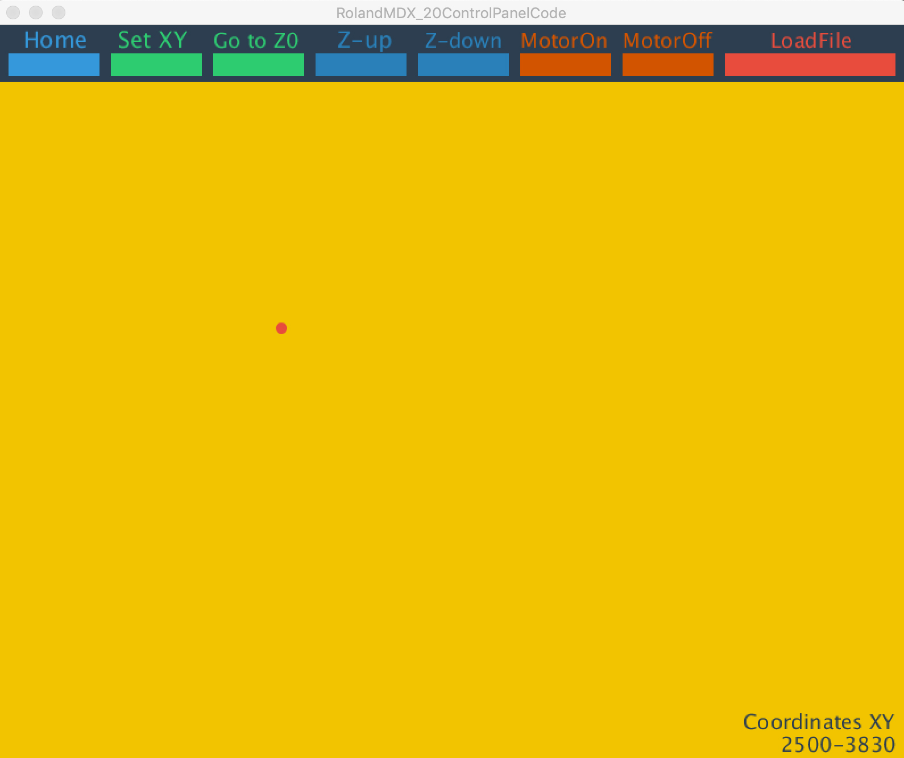

# SimplyFAB-20 - GUI for Roland MDX-20

## Easy interface to control the Roland MDX-20

*January 2019, by Eduardo Chamorro, Yiannis Romanos Vogdanis.Project started in 04-02-2016 by Mithru. *

* Interface to send .rml files to the Roland MDX-20 in a friendly interface.
* Coded with processing and compiled as APP for Windows and Linux
* Valid with the standart files comming from FabModules/MODS.
* You can setup the XY origin in the programm no longer needed to do it in Fabmodules/Mods
* Ability to swith On/Off the spindle
* Loading files from the interface.
* Go to Z zero position to check the Z set up with the Z UP/DOWN hardware buttons on the modela.
* Homing button to check the end limits of the machine.

### 1.Circuit Design

1. Design your circuit on Fritzing or Eagle. File > Export > PNG with black background (and white fill for the circuit). The dpi should be 500.

### 2.Fab Modules
1. Open [http://fabmodules.org/](http://fabmodules.org/)
2. Click **input format**. Select **image (.png)**, and load the png that you just exported.
3. Ensure the dpi is at least 500.
4. Click **output format** and **Roland mill (.rml)**.
5. On the right, click **machine** and select **MDX-20**.
6. Click **process** and **PCB traces (1/64)**
7. **Speed** can be 4 (but can be fine-tuned - thinner drill bits might require lower speeds, but this will need testing)(We recommed using 2 to ensure the endmill durability)
8. Set **x0** and **y0** to 0.( We will setup the XY origin in the interface)
9. **zjog** is set automatically to (z0+2). In our lab we change to (z0+5) for safety.
10.  **xhome, yhome** and **zhome** can be set to 0.(final position the machine will reach when it finishes)
11. The default settings should be fine but you'll need to make sure of it (in the next step)
12. Click **calculate**. You'll notice the program try to plot out paths.
13. Once done checking, click **save**.(will automatically save on to your download folder)

### 3.Sending RML to the machine

1. Open **RolandMDX_20ControlPanel.pde** or the compiled program version **RolandMDX_20ControlPanel**
2. Move the spindle position by clicking on the yellow window( it is the machine bed/working space)
3. Once you get to your desired position select  **SET XY** to set the origin for XY
4. To setup the Z position we have to move mill bit manually with the machine UP/DOWN buttons(located on the front of the machine).*I recommend doing it with the spindle on until touching the PCB plate* **The Z is not setup on the sofware but with the hardware buttons.**.The machine don´t remember the Z position setup with the interface buttons up/down.
5. Select your file with the *LOADFILE* button and press enter to start cutting.

--

### Troubleshooting

1. *Nothing happens when I send the rml over.*  

	* Make sure the transparent cover is placed properly on the roland machine - there's a sensor/switch that prevents the drill from spinning if the cover is not placed properly.   
	* Also make sure the light next to the VIEW button on the roland machine is off. Press the button to toggle it.( This button is for bringing the platform closer to the user and the machine enters pause mode)
	* If the green VIEW light is on, it anything you send will be stored in buffer and it will execute when set right (this can be annoying).

2. *One of the LEDs is blinking angrily*
	* If one of the LEDs blink very fast it's likely that something went wrong and you might have to stop sending RML, turn off and on the machine and re-send the RML file. If it persists, something isn't being done right - check the guide carefully.
	* A known cause for this is the roland machine is receiving too many messages before being able to execute (each line in the RML file is sent every two seconds by the processing sketch - if the drill cannot keep up, the LED blinks really fast).

3. *I checked the code and it send the command slowly*
 * The processing sketch can be smarter - eg. there's currently a second delay between each line sent from the rml file to ensure we don't flood the roland machine with all commands at once.

--

### Tools Needed

1. *Mill Bits*
	* Micro milling bit for PCB for the traces cut (0.0156" DIA 2FL SE AlTiN 1/64).[1/64 Flat Endmill](http://www.carbidedepot.com/00156in-DIA-2FL-SE-AlTiN-164-P180142.aspx)
	* Micro milling bit for PCB for the traces outcut and holes(0.0312" DIA 2FL SE AlTiN 1/32).[1/32 Flat Endmill](http://www.carbidedepot.com/00312in-DIA-2FL-SE-AlTiN-132-P180143.aspx)

2. *MDX 20 ROLAND*
 * With the proper collet for the endmills and the serial adapter cable.

--

### To do
* Test other types gcodes from fabmodules/mod for example 3d milling
* Create and interface for the 3d scanning probe
* Fix the Z zero setup by software
* Be able to send to determinate coordinates on the interface

--

### References

 - [Fab modules](http://fab.cba.mit.edu/content/processes/PCB/modela.html), how to make circuits on the Modela milling machine, also a good resource to setup and problem shoot the Modela.
 - [Media Lab Helsinki](http://mlab.taik.fi/paja/?p=1874), making PCB with Roland Modela MDX-20 (Eagle version). The website including rml guidelines and more are available as [.zip](http://mlab.taik.fi/paja/wp-content/uploads/2011/01/eagle_files4roland_modela.zip) file for download. The tutorial uses the [Eagle layout editor](http://www.cadsoftusa.com/eagle-pcb-design-software/) to design PCBs. If you're using Fritzing, [this](http://mlab.taik.fi/paja/?p=2768) is the guide.
 - [bringing a 12 year old Roland MDX-20 up to date](http://vonkonow.com/wordpress/2012/08/bringing-a-12-year-old-roland-mdx-20-up-to-date/)
 - .rml or .rml-1 format to instruct a Modela milling machine. [RML-1 Programming Guide](http://mlab.taik.fi/paja/wp-content/uploads/2011/01/RML1_Command_GuideENVer100.pdf)
 - [sending rml to mdx-20 on unix](http://fab.cba.mit.edu/classes/MIT/961.04/topics/pcb_modela.html)
 - [Roland circuit board milling](http://shop.itp.nyu.edu/PCBStation/roland-modela/roland-circuitboard-milling)
 - [Roland Command guide](http://altlab.org/d/content/m/pangelo/ideas/rml_command_guide_en_v100.pdf)

--
